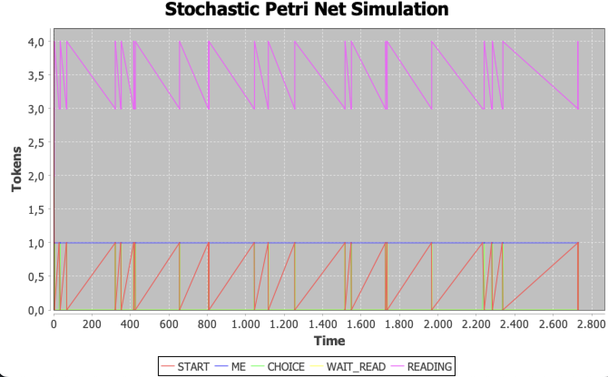
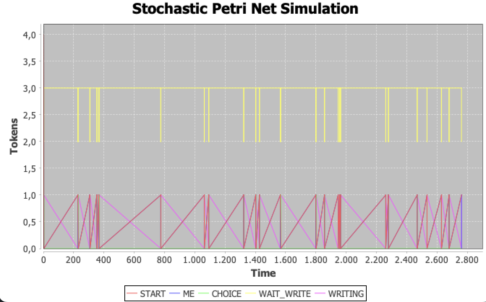
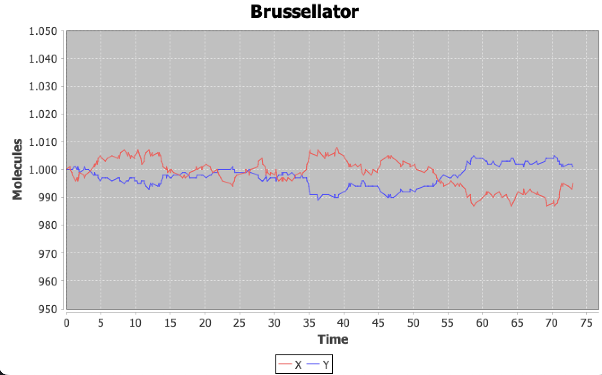

# asmd-23

This repository contains the code to achieve the exam of the course "Advanced Software Modelling and Design" (2023–2024)
at UniBo.

The main topics covered are:

- Acceptance Testing
- Stochastic Modelling
- Large Language Models

## Stochastic Petri Nets

### Domain Specific Language

It has been created a Domain Specific Language to create Stochastic Petri Nets.
The DSL implementation is built on top of the already provided `SPN` implementation,
keeping it untouched and exploiting the Scala scalability.

One line import to use the DSL:

```scala 3
import spn.dsl.DSL.{given, *}
```

The DSL keeps the possibility to create `SPN` of whatever type:

```scala 3
val spn1: SPN[Int] = (from(1, 2) to 3 withRate 1.0) and (from(4, 5) to 6 withRate 2.0)
val spn2: SPN[String] = from("a", "b") to "c" withRate 1.0 inhibitedBy "d"

enum Whatever:
  case A, B, C

import Whatever.*

val spn3: SPN[Whatever] = from(A, B) to(C, D) withRate 0.01
```

#### Acceptance Testing

In [SPN-DSL.feature](src/test/resources/features/SPN-DSL.feature) there are some scenarios describing the DSL feature.
The scenarios involve the creation of various `SPN` models, using the wanted DSL syntax.
The input is run during the tests by the Scala compiler, via reflection.
In this way it is possible to verify that the inputs in DSL format are correct Scala code and that the output is the
expected `SPN` model.

### Stochastic Readers and Writers

A stochastic version of the Readers and Writers problem has been implemented exploiting the DSL:

```scala 3
enum Place:
  case START, CHOICE, WAIT_READ, WAIT_WRITE, READING, WRITING, ME
import Place.*

val rwSPN: SPN[Place] =
  (from(START) to CHOICE withRate 1.0) ++
    (from(CHOICE) to WAIT_READ withRate 1.0) ++
    (from(CHOICE) to WAIT_WRITE withRate 1.0) ++
    (from(WAIT_READ, ME) to(ME, READING) withRate 1.0) ++
    (from(WAIT_WRITE, ME) to WRITING withRate 1.0 inhibitedBy READING) ++
    (from(READING) to START withRate 1.0) ++
    (from(WRITING) to(START, ME) withRate 1.0)
```

In the following figures are reported the charts representing two different simulations of the Readers and Writers
problem.
In the first chart, the system is always in the Reading state, because the markovian rates are set to make the system
prefer reading to writing.
In the second chart, the system is always in the Writing state, for the opposite rates
configuration.

<p align="center">


</p>


Once created the SPN model, `ScalaCheck` has been used to test the simulations and to verify that all invariant
properties hold ([ReadersWritersCheck](src/test/scala/spn/examples/ReadersWritersCheck.scala)).

This is achieved by generating multiple instances of Petri Nets with various markovian rates and number of
initial tokens, to ensure that properties hold for different simulations.

### Chemist

Chemical reactions are intrinsically stochastic, and can be modelled as Continuous Time Markov Chains, and so as
Stochastic Petri Nets.

To make some tests, the _Brussellator_ model has been reified as a `SPN`, exploiting the DSL:

```scala 3
enum Element:
  case A, B, D, E, X, Y
import Element.*

val brussellatorSPN: SPN[Element] =
  (from(A) to X withRate 1) ++
    (from(X, X, Y) to(X, X, X) withRate 1) ++
    (from(B, X) to(Y, D) withRate 1) ++
    (from(X) to E withRate 1)
```

A particularity of the Brussellator model is that, under certain conditions, species `X` and `Y`
oscillate in concentration. This is because the reaction is autocatalytic.

Indeed, the simulations run on the Brussellator model show kind of oscillations in the concentration of `X` and `Y`.
<p align="center">

</p>

## Large Language Models

It has been explored the possibility to successfully prompt LLMs in order to make it generate
Stochastic Petri Nets exploiting the implemented DSL.

The goal here is to verify if, with proper prompt engineering techniques, it is possible to make the LLMs
generate correct Scala code representing a SPN model, without necessarily fine-tuning the model itself.

### Models

Two models have been created starting from:

- `LLama3` from Meta (8B parameters)
- `Gemma2` from Google (9B parameters)

[Ollama](https://ollama.com/) permits to create new models starting from other models.
This can be done creating a **Modelfile**, the syntax of which is still in development.

An example of a simple Modelfile is the following:

```dockerfile
FROM gemma2:9b
# sets the temperature to 1 [higher is more creative, lower is more coherent]
PARAMETER temperature 0.3

# sets a custom system message to specify the behavior of the chat assistant
SYSTEM """You are a bank assistant"""

MESSAGE user How can I make a deposit?
MESSAGE assistant You can make a deposit by going to the bank and asking the teller to help you.
```

Note that the model created is not re-trained and fine-tuned, but it is just the same starting model with predefined
prompts and parameters.

In this case, the main exploited techniques are:

- _Few-shot learning_
- _Chain of thought_

### Integration

Once the models are ready, they are used to generate Scala code representing a SPN model.
[OllamaClient](src/main/scala/spn/llm/OllamaClient.scala) provides a method to interact with the Ollama API and retrieve
the LLM response.

One goal of the work was to make the LLM return just the Scala code, to enable the possibility to run it directly via
reflection.

Then, to verify the generated code, a test suite has been created to check the correctness of the Scala code and to test
Petri Nets properties.
This is done by generating multiple instances of Petri Nets using both models (LLama3 and Gemma2)
and various prompts regarding the same model concept.

In the following, is reported the generation of instances using `ScalaCheck`:

```scala 3
val prompts: Gen[String] = Gen.oneOf(
  s"Provide me a simple Stochastic Petri Net with...",
  s"Can you provide me a SPN with ...",
  s"Give me the scala code for a SPN with ..."
)
val models: Gen[Model] = Gen.oneOf(Model.values)
val spns: Gen[Option[SPN[Any]]] = for
  model <- models
  prompt <- prompts
yield reflect(askToModel(model, prompt))
```

It is important to notice that the LLMs are prompted to generate not just the `SPN` but also the data type representing
places. 
That's why the `SPN` is of type `SPN[Any]`.

The tests regarding the LLMs are located in the [llm](src/test/scala/spn/llm) package.
